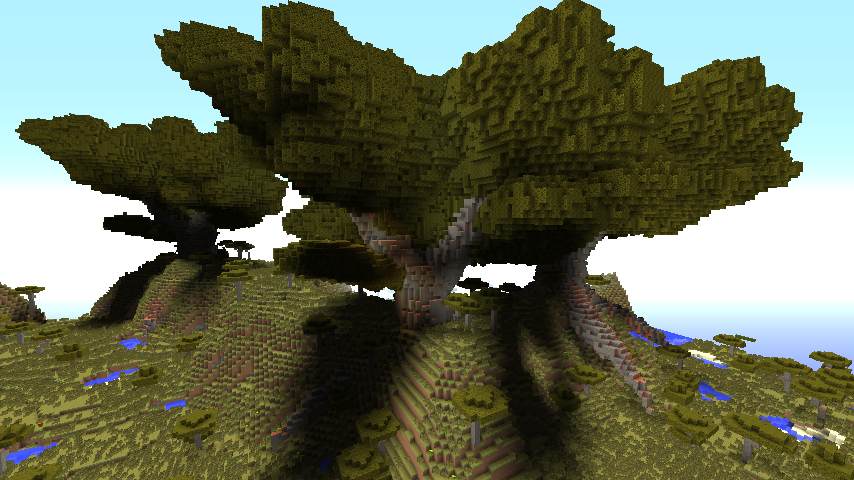
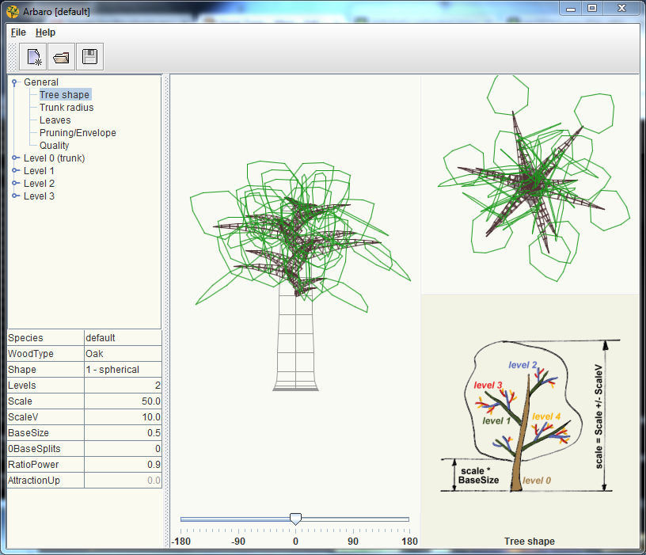

# GiantTrees



_This plugin now only uses official Bukkit APIs, so it should be future proof. Recently tested with Spigot 1.15._

Giant Trees is a plugin for adding procedurally generated giant trees to your Spigot world. Giant trees are generated in 
three ways:

* Grow trees in creative/survival mode by planting saplings and fertilizing with bone meal
* Summon trees with a command
* Generate trees naturally when new forested biomes spawn

Giant Trees is based on the tree generation algorithm described in Creation and Rendering of Realistic Trees by 
Jason Weber and Joseph Penn as implemented by Wolfram Diestel in Arbaro.

* http://sourceforge.net/projects/arbaro/
* http://ftp.cs.duke.edu/courses/fall02/cps124/resources/p119-weber.pdf

## IMPORTANT NOTES for version 3.1
The 3.1 version uses a new configuration file format. You cannot use the old configuration file with this version.
If you do the plugin will detect an incorrect configuration and disable the tree generation. You must wipe out
the old GiantTrees folder in the plugins folder and let it create a new config and then you can put back any
settings you changed. The 3.1 version and the new config file format allows for custom trees beyond the standard
saplings and now gives you the option of changing patterns for the base tree set too. For example, the new mesapuzzle
tree has a pattern that is made from both Acacia and Oak saplings. Each tree in the game has it's own recipe now and
doesn't use the 'S' sapling generic pattern. Core block is indicated by an 'X'. Check the config file for details.

You now need to right click the core block and not the saplings in order to generate the tree.

The pattern matching routine has also been changed to be simpler and I think, more flexible for future updates.
It uses a series of 90 degree rotations of the recipes in an attempt to match a sapling pattern laid out in the 5x5
grid. This means you can put put a complex pattern but not have to worry about compass orientation. It currently
doesn't flip the pattern, but that might be something to add later.

Do not use the reload command on your server. Restart the server for changes to take effect.
If you encounter lag, try reducing the number of blocks updated per tick in the config. Dark Oak is really laggy!
Ensure you have at least 2GB of memory allocated to the server.

Report any issues on the github repository.

## Planting Giant Trees

To plant a giant tree in creative/survival mode, perform the following steps:

1. Flatten a 5x5 area of dirt or grass
1. Place the core block as defined in the config (default EMERALD_BLOCK) in the center
1. Surround the core block with two rings of saplings according to the pattern for the tree you want
1. Right click the core block with a stack of 64 bone meal
1. Stand back (default of 3 seconds to get out of the way)


## Commands
To create a giant tree with a command, use the /tree-create or /gt command, followed by the name of the tree. Tree names 
are found in the plugin's data directory. For example, to summon a giant acacia tree, use the command

```
/gt tree.ACACIA
```

To edit the model for an existing tree, or create a new tree model, use the /tree-edit command. This command can only 
be used from the server console.

```
/tree-edit tree.ACACIA
```

## Naturally Growing Trees

By default, Giant Trees will grow naturally in newly generated chunks in the default overworld (the world called 
"world"). To add giant trees to more worlds, increase the frequency of tree growth, or disable natural tree growth
altogether, edit the plugin's config.yml.

## Making Your Own Giant Tree Species

You can make your own species of giant tree. Start by using the /tree-edit command from the server console, giving it
the name of the tree you want to edit or create. (For new trees, ignore the file not found error). As an alternative,
you can double-click the Giant Trees plugin .jar file to start the visual tree editor.



Design your tree using the visual tree editor. When you are done, click save and exit the visual editor. To add roots to
your tree, create another tree with the same name as your tree, with .root added to the end. For example, 
`/tree-edit tree.ACACIA.root`. Root trees are rendered upside down in the world and scaled to match their tree.

## Permissions

* `gianttrees.create` (default OP) - Allows the creation of a giant tree using the tree-create command.
* `gianttrees.grow` (default true) - Allows a player to grow a giant tree by fertilizing a grid of saplings.

## Installation

1. Make sure you have Apache Maven installed.
1. Clone this repo.
1. Run `mvn package` in the plugin directory.
1. Copy the Giant Trees jar file from the `target` directory to your server's `plugins` directory.
1. Restart your server.

or the simple way:

1. Download the jar file from the latest release in the github repository
1. Move the jar file to the plugins folder
1. Restart your server.
